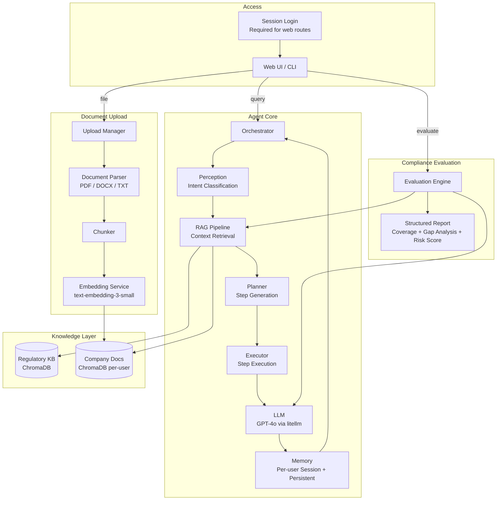

# Compliance RAG Agent Framework

<p align="left">
  
  
  
  
  
  
</p>

An AI-powered compliance evaluation platform that helps organisations assess their security and regulatory posture against major industry standards. Built on a structured Planning + Execution agent architecture with a RAG (Retrieval-Augmented Generation) pipeline, company document ingestion, a structured compliance evaluation engine, and a session-based login for per-user data isolation.

---

## Architecture



---

## Project Structure

```
.
├── auth/
│   └── user_store.py         # Fixed user accounts with hashed passwords (werkzeug)
│
├── agent/
│   ├── orchestrator.py       # Central coordinator that runs the full pipeline
│   ├── perception.py         # Intent classification (LLM + keyword fallback)
│   ├── planner.py            # LLM-based step-plan generation with RAG context
│   ├── executor.py           # Executes plan steps via LLM reasoning
│   └── memory.py             # Per-user session memory + long-term JSON persistence
│
├── knowledge/
│   ├── vector_store.py       # ChromaDB wrapper with per-user namespace isolation
│   ├── rag_pipeline.py       # Retrieves context from regulatory KB + company docs
│   ├── knowledge_base.py     # Ingests knowledge_data/ into vector store on startup
│   └── embeddings.py         # OpenAI text-embedding-3-small batch embedding service
│
├── knowledge_data/           # Authoritative regulatory standard summaries (Markdown)
│   ├── iso_27001.md
│   ├── soc2.md
│   ├── gdpr.md
│   ├── nist_csf.md
│   ├── hipaa.md
│   ├── pci_dss.md
│   ├── cobit.md
│   ├── iso_22301.md
│   ├── iso_31000.md
│   ├── csa_ccm.md
│   ├── basel_framework.md
│   ├── psd2_open_banking.md
│   ├── swift_csp.md
│   ├── fatf_guidelines.md
│   ├── pakistan_aml_cft.md
│   ├── peca_2016.md
│   ├── sbp_regulations.md
│   └── secp_guidelines.md
│
├── document_upload/
│   ├── manager.py            # Full upload pipeline: validate, parse, chunk, embed, store
│   ├── parser.py             # Text extraction for PDF, DOCX, and TXT files
│   ├── chunker.py            # Word-count-based chunking with configurable overlap
│   └── validation.py         # File signature checks, safe filenames, size caps, instruction neutralisation
│
├── evaluation/
│   ├── engine.py              # RAG-powered compliance gap analysis engine
│   ├── report_store.py        # Persists and retrieves evaluation reports per user
│   ├── citation_validator.py  # Checks every cited identifier against the retrieved context
│   ├── ablation_eval.py       # Component ablation benchmark (chunking, retrieval, planner)
│   ├── benchmark_v2.py        # The 42-question benchmark set and scoring rubric
│   ├── retrieval_eval.py      # Standalone retrieval quality measurement (recall@k, MRR)
│   ├── risk_sensitivity.py    # Sensitivity analysis for the regulatory risk score
│   ├── adversarial_eval.py    # Adversarial test: a fabricated regulation uploaded as policy
│   ├── citation_audit.py      # Re-checks citation grounding on a completed benchmark run
│   └── quantitative_eval.py   # Original baseline-vs-RAG benchmark runner
│
├── audit/
│   ├── audit_logger.py       # Hash-chained, tamper-evident audit trail logger
│   └── evidence_trace.py     # Structured evidence trace per analysis (not a reasoning log)
│
├── utils/
│   ├── logger.py             # Singleton logger (component-scoped)
│   └── run_config.py         # Pinned model snapshot, seed, corpus hash, run manifest
│
├── templates/
│   ├── login.html            # Login page
│   └── index.html            # Single-page web UI (chat + document upload + evaluation)
│
├── tests/                    # 101 tests covering audit chaining, citation validation,
│                              # evidence traces, upload hardening, and tenant isolation
│
├── web_app.py                # Flask web server, authentication, and REST API
├── main.py                   # CLI entry point (interactive and batch modes)
└── requirements.txt
```

> On first startup the app seeds a `users.json` file with the default accounts (see Authentication). This file holds hashed passwords and is gitignored, so it regenerates if deleted.

---

## Authentication

The web application is protected by a session-based login. Accounts are fixed (there is no public sign-up), and every data route requires an authenticated session. The logged-in user's identity is taken from the server session, never from the request body, so a client cannot act as another user.

Passwords are hashed with `werkzeug.security` and stored in `users.json`, which is created and seeded automatically on first run.

### Default accounts

| Username | Password | Name | Role |
|---|---|---|---|
| `john` | `john123` | John Smith | Default User |
| `sarah` | `sarah123` | Sarah Johnson | Analyst |
| `michael` | `michael123` | Michael Chen | Auditor |
| `emily` | `emily123` | Emily Davis | Compliance Officer |

These are demo credentials. To change a password or add an account, edit `auth/user_store.py` and delete `users.json` so it reseeds on the next start. Each account maps to its own data namespace, so uploaded documents and reports stay isolated per user.

> The command-line interface (`main.py`) is a local developer tool and does not use the login layer.

---

## Key Components

### Agent Pipeline
Every user query follows a fixed pipeline:

| Stage | Component | Role |
|---|---|---|
| 1 | **Perception** | Classifies intent: `compliance_evaluation`, `document_query`, `information_seeking`, `problem_solving`, `planning`, `general_query` |
| 2 | **RAG Pipeline** | Retrieves relevant chunks from the regulatory knowledge base and the user's uploaded company documents |
| 3 | **Planner** | Uses the LLM to generate a structured JSON step-plan, enriched with the RAG context |
| 4 | **Executor** | Executes each plan step sequentially, injecting RAG context into every LLM call |
| 5 | **Memory** | Stores the interaction in per-user session memory and persists it to `agent_memory.json` |

Conversation memory is scoped per user, so follow-up questions keep their context and one user's session reset never affects another user's history.

### RAG & Knowledge Layer
- **Regulatory KB**: Eighteen authoritative compliance standards pre-loaded from `knowledge_data/` into a shared `regulatory_knowledge` ChromaDB collection on first startup.
- **Company Documents**: User-uploaded documents are parsed, chunked, embedded, and stored in a per-user isolated collection (`company_docs_{user_id}`).
- **Context injection**: RAG context is injected at three levels: the Planner prompt, each Executor LLM call, and the final result compilation, so responses stay citation-backed throughout.
- **Citation validation**: the system prompt asks the model to cite only identifiers present in the retrieved context, and `citation_validator.py` checks this outside the model as well. Every regulatory identifier in a generated report is matched against the retrieved chunks, and unsupported ones are flagged rather than silently kept. This verifies that an identifier came from a retrieved chunk, not that the chunk itself is accurate.

### Audit Trail
Every system action is recorded to `audit_logs/audit_log.jsonl` via the `AuditLogger` singleton. Entries are hash chained: each one carries the hash of the entry before it and a hash of its own contents, so editing or deleting an entry breaks every link after it. A verification routine reports where the chain failed. Appends are serialised by a lock, which tests confirm is load bearing, since removing it under a concurrent workload lost entries and broke the chain. This gives tamper evidence, not tamper prevention: anyone with filesystem access can still rebuild the chain from scratch. Tracked actions include:

| Action | Description |
|---|---|
| `LOGIN` | User signed in (success or failure) |
| `LOGOUT` | User signed out |
| `CHAT_QUERY` | User sent a chat query |
| `DOCUMENT_UPLOAD` | Document uploaded to the system |
| `DOCUMENT_DELETE` | Document deleted from the system |
| `EVALUATION_RUN` | Compliance evaluation executed |
| `REPORT_DOWNLOAD` | Evaluation report downloaded |
| `REPORT_DELETE` | Evaluation report deleted |
| `KNOWLEDGE_DOWNLOAD` | Regulatory knowledge document downloaded |
| `SESSION_RESET` | User session reset |
| `SYSTEM_START` | Application started |
| `SESSION_END` | Application shut down |

The audit log supports filtering by `action`, `resource_type`, timestamp range, and status. Each user's queries and export are scoped to their own actions.

### Report Store
Evaluation reports are persisted as JSON files under `reports/{user_id}/{report_id}.json` by `ReportStore`. Reports can be listed, retrieved, downloaded as Markdown, or deleted via the API.

### Compliance Evaluation Engine
Triggered via the `/evaluate` endpoint or the web UI. The engine:
1. Retrieves the user's company documents via RAG, optionally restricted to specific selected documents
2. Retrieves the relevant regulatory standards via one query per standard, which avoids similarity crowding
3. Sends a structured prompt to the LLM for gap analysis at temperature 0
4. Returns a formatted Markdown report

The report covers:
- **Executive Summary**
- **Standards Coverage**: a status line for every selected standard, marked Findings, Documentation gap, or Not applicable, so no standard is silently dropped
- **Compliant Areas** with standard references
- **Gap Analysis** with risk levels (Critical / High / Medium / Low)
- **Risk Assessment** (likelihood and impact)
- **Regulatory Risk Score and Prioritization**: a transparent score per gap computed as Obligation Severity x Likelihood x Adequacy Gap, sorted highest to lowest
- **Recommendations** ordered by priority with effort estimates

An evaluation can target up to ten standards at a time, which keeps report generation within the model's token budget.

### Supported Standards

| Standard | Domain |
|---|---|
| ISO 27001 | Information Security Management |
| SOC 2 | Security, Availability and Confidentiality |
| GDPR | EU Data Protection |
| NIST CSF | Cybersecurity Framework |
| HIPAA | Healthcare Data Privacy |
| PCI DSS | Payment Card Security |
| COBIT | IT Governance and Management |
| ISO 22301 | Business Continuity Management |
| ISO 31000 | Risk Management |
| CSA CCM | Cloud Security Alliance, Cloud Controls Matrix |
| Basel Framework | Banking Capital and Risk Regulation |
| PSD2 / Open Banking | EU Payment Services Directive |
| SWIFT CSP | SWIFT Customer Security Programme |
| FATF Guidelines | Anti-Money Laundering / Counter-Terrorist Financing |
| Pakistan AML/CFT | Pakistan AML and CFT Rules |
| PECA 2016 | Pakistan Electronic Crime Act |
| SBP Regulations | State Bank of Pakistan Regulations |
| SECP Guidelines | Securities and Exchange Commission of Pakistan |

---

## Reproducibility

`utils/run_config.py` is the single place every LLM call resolves its model, seed, and temperature through, so a run can be reproduced or at least identified later. It pins a dated model snapshot rather than a moving alias like `gpt-4o`, which changes over time without notice. Each run records:

- the model and embedding snapshot in use
- the request seed and the returned system fingerprint, since OpenAI states that a fixed seed makes repeated requests more likely to match but does not guarantee it, and recommends watching the fingerprint for backend changes
- a SHA-256 hash of the regulatory corpus, so a change to `knowledge_data/` is detectable
- the installed package versions and the current git commit

Temperature zero reduces sampling variability on its own but does not make a hosted model fully deterministic, which is why the seed and fingerprint are tracked as well.

---

## Research Evaluation Suite

The `evaluation/` directory also holds the scripts used to produce the benchmark results reported in the accompanying paper. These are separate from the live application and cost API calls to run:

| Script | What it measures |
|---|---|
| `benchmark_v2.py` | The 42-question benchmark: single-fact, multi-standard, and multi-step categories, with ground truth checked against the corpus and a fixed scoring rubric |
| `ablation_eval.py` | Compares seven configurations (chunking strategy, retrieval strategy, with and without the planner) under a matched context budget, scored blind by two judge models |
| `retrieval_eval.py` | Recall@k and mean reciprocal rank for retrieval on its own, without generation |
| `citation_audit.py` | Re-checks every regulatory identifier in a completed run's answers against the context each answer actually received |
| `risk_sensitivity.py` | Enumerates every combination the regulatory risk score can produce, to check whether the priority-band thresholds are stable |
| `adversarial_eval.py` | Uploads a fabricated regulation as a company document and checks whether the system treats it as authoritative |

Run any of them with `python -m evaluation.<script_name>`. Results are written to `evaluation/results/`, which is not tracked in this repository; the final results referenced in the paper are archived separately.

---

## Testing

```bash
python -m unittest discover -s tests
```

101 tests across six files, covering audit log hash chaining and tamper detection, citation validation, evidence trace redaction, upload hardening (including the directory traversal fix), and cross-tenant data isolation. The isolation and audit-lock tests were checked for sensitivity by deliberately injecting a fault and confirming the tests catch it, rather than assumed to be meaningful.

---

## Prerequisites

- Python 3.10+
- An **OpenAI API key** (used for both the LLM via `litellm` and the embedding model)

---

## Installation

**1. Clone the repository**

```bash
git clone <repository-url>
cd EnterpriseComplianceFramework
```

**2. Create and activate a virtual environment**

```bash
python -m venv venv

# Windows
venv\Scripts\activate

# macOS / Linux
source venv/bin/activate
```

**3. Install dependencies**

```bash
pip install -r requirements.txt
```

**4. Configure environment variables**

Copy the example below into a `.env` file in the project root and fill in your API key:

```env
# Required
OPENAI_API_KEY=your-openai-api-key-here

# Authentication
SECRET_KEY=change-this-to-a-long-random-string
USERS_FILE=./users.json

# LLM Settings
DEFAULT_MODEL=gpt-4o-2024-08-06
SEED=42
TEMPERATURE=0.0
MAX_TOKENS=6000
MAX_ITERATIONS=5

# Memory
MEMORY_FILE=agent_memory.json

# RAG / Vector Store
CHROMA_DB_PATH=./chroma_db
EMBEDDING_MODEL=text-embedding-3-small
CHUNK_SIZE=500
CHUNK_OVERLAP=50
RAG_TOP_K=5

# Knowledge Base
KNOWLEDGE_BASE_PATH=./knowledge_data

# Document Upload
UPLOAD_DIR=./uploads
MAX_UPLOAD_SIZE_MB=50

# Reports & Audit
REPORTS_DIR=./reports
AUDIT_LOG_DIR=./audit_logs

# Logging
LOG_LEVEL=INFO
```

> Set `SECRET_KEY` to a long random value. It signs the session cookie, so keep it private and out of version control.

> On first startup the system ingests all files from `knowledge_data/` into ChromaDB. It also re-ingests automatically whenever those files change, so no manual steps are needed after updating a knowledge file.

---

## Running the Application

### Web Interface (Recommended)

```bash
python web_app.py
```

Open [http://localhost:5000](http://localhost:5000) in your browser. You will be redirected to the login page. Sign in with one of the default accounts, for example `john` / `john123`. To switch users, sign out and sign back in as another account.

### CLI, Interactive Mode

```bash
python main.py --mode interactive
```

Available commands inside the session:

| Command | Action |
|---|---|
| `status` | Show system status (model, tools, memory counts) |
| `reset` | Clear current session memory |
| `verbose` | Toggle verbose step-by-step output |
| `quit` / `exit` | Exit the session |

### CLI, Batch Mode

```bash
python main.py --mode batch --query "What are the key controls under ISO 27001 Annex A?"
```

Optional flags:

```
--model   gpt-4o          LLM model to use (default: gpt-4o)
--verbose                 Print step-by-step execution logs
```

---

## Using the Web Interface

### Chat
Ask any compliance-related question in the chat panel. The agent retrieves relevant regulatory context and your uploaded company documents before responding.

**Example queries:**
- *What are the key requirements of GDPR Article 32?*
- *How does our security policy align with NIST CSF?*
- *What controls does ISO 27001 require for access management?*

### Document Upload
Drag and drop, or click to browse, a company document (PDF, DOCX, or TXT, max 50 MB) into the upload panel. Once processed, the document is chunked, embedded, and stored in your user-scoped vector collection and will be referenced automatically in subsequent chat queries and evaluations.

Uploaded files are treated as untrusted input. The filename is reduced to a bare basename before it touches any path, which closes a directory traversal issue found during testing where a crafted filename could write outside the user's own upload folder. The file's contents are checked against its claimed extension, so a renamed executable is rejected rather than parsed. Page count, paragraph count, and extracted character count are capped before parsing. Text inside a document that addresses the model rather than the reader is marked and left in place, since silently deleting it would hide part of the document being assessed. These checks reduce the attack surface but do not eliminate prompt injection.

### Compliance Evaluation
1. Select which uploaded documents to include using the checkboxes
2. Select up to ten standards from the evaluation panel
3. Click **Run Compliance Evaluation**

The system retrieves your selected documents and the relevant regulatory standards, then produces a structured report with:
- Executive summary
- Standards coverage (Findings, Documentation gap, or Not applicable per standard)
- Compliant areas (with references)
- Gap analysis (with risk levels: Critical / High / Medium / Low)
- Risk assessment (likelihood and impact)
- A regulatory risk score and prioritization table
- Prioritised recommendations (with effort estimates)

---

## REST API Reference

All data endpoints require an authenticated session. Requests without a valid session receive `401 Authentication required`, and the browser is redirected to the login page. The active user is derived from the session, so `user_id` is never passed by the client.

| Method | Endpoint | Description |
|---|---|---|
| `GET` / `POST` | `/login` | Show the login page (GET) or authenticate a username and password (POST) |
| `POST` | `/logout` | Clear the session |
| `POST` | `/chat` | Send a message; body: `{message, verbose}` |
| `POST` | `/upload` | Upload a document; multipart form: `file` |
| `GET` | `/documents` | List documents uploaded by the current user |
| `DELETE` | `/documents/<doc_id>` | Delete a specific document and its vector chunks |
| `POST` | `/evaluate` | Run compliance evaluation; body: `{standards, doc_ids}` (max 10 standards) |
| `GET` | `/reports` | List saved evaluation reports for the current user |
| `GET` | `/reports/<report_id>` | Retrieve a specific report |
| `DELETE` | `/reports/<report_id>` | Delete a specific report |
| `GET` | `/reports/<report_id>/download` | Download a report as a Markdown file |
| `GET` | `/audit/logs` | Query the current user's audit trail (filters: `action`, `resource_type`, `start_date`, `end_date`, `status`, `limit`, `offset`) |
| `GET` | `/audit/summary` | Aggregate audit statistics |
| `GET` | `/audit/export` | Export the current user's audit log as CSV |
| `GET` | `/status` | System component status |
| `GET` | `/knowledge/status` | Regulatory knowledge base status |
| `GET` | `/knowledge/standards` | List all loaded regulatory standards with metadata |
| `GET` | `/knowledge/standards/<filename>/download` | Download a regulatory standard document as a Markdown file |
| `POST` | `/reset` | Reset the current user's session memory |

---

## Extending the Framework

### Adding a New Regulatory Standard
1. Add a `.md` or `.txt` file to `knowledge_data/`
2. Restart the application, which detects the change and re-ingests automatically

### Adding or Changing a User Account
1. Edit the account list in `auth/user_store.py`
2. Delete `users.json` so it reseeds on the next start

---

## Configuration Reference

All settings are controlled via environment variables with sensible defaults built into each component.

| Variable | Default | Description |
|---|---|---|
| `OPENAI_API_KEY` | required | OpenAI API key |
| `SECRET_KEY` | `dev-secret-change-me` | Secret used to sign the session cookie |
| `USERS_FILE` | `./users.json` | Path to the seeded user account store |
| `DEFAULT_MODEL` | `gpt-4o-2024-08-06` | Dated model snapshot (any litellm-supported model; avoid moving aliases like `gpt-4o`) |
| `SEED` | `42` | Request seed passed to every completion call |
| `TEMPERATURE` | `0.0` | LLM temperature; 0 reduces sampling variability but does not guarantee determinism on its own |
| `MAX_TOKENS` | `6000` | Max tokens per LLM response (set higher for large evaluations) |
| `CHROMA_DB_PATH` | `./chroma_db` | ChromaDB persistence directory |
| `EMBEDDING_MODEL` | `text-embedding-3-small` | OpenAI embedding model |
| `CHUNK_SIZE` | `500` | Words per document chunk |
| `CHUNK_OVERLAP` | `50` | Overlap words between consecutive chunks |
| `RAG_TOP_K` | `5` | Number of chunks retrieved per RAG query |
| `KNOWLEDGE_BASE_PATH` | `./knowledge_data` | Directory for regulatory Markdown files |
| `UPLOAD_DIR` | `./uploads` | Directory for user-uploaded documents |
| `MAX_UPLOAD_SIZE_MB` | `50` | Maximum upload file size |
| `REPORTS_DIR` | `./reports` | Directory for persisted evaluation reports |
| `AUDIT_LOG_DIR` | `./audit_logs` | Directory for audit trail log files |
| `MEMORY_FILE` | `agent_memory.json` | Path for long-term memory persistence |
| `LOG_LEVEL` | `INFO` | Logging level (`DEBUG`, `INFO`, `WARNING`, `ERROR`) |
