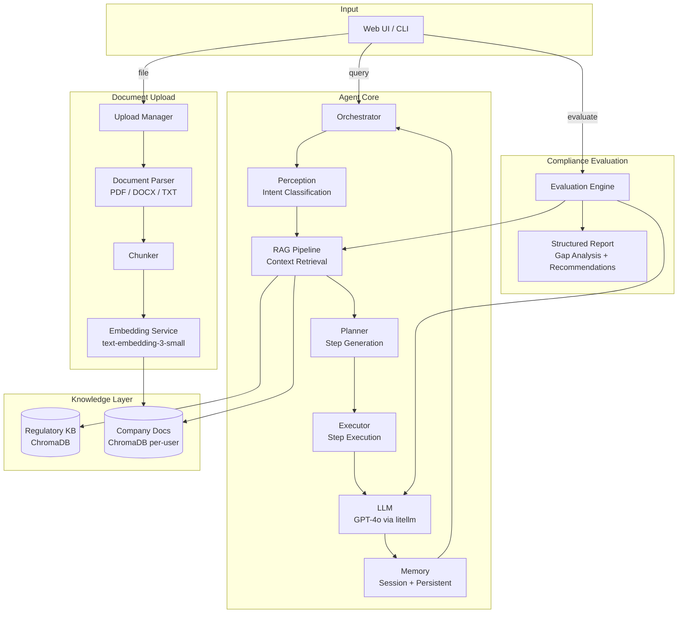

# Compliance RAG Agent Framework

An AI-powered compliance evaluation platform that helps organisations assess their security and regulatory posture against major industry standards. Built on a structured Planning + Execution agent architecture with a RAG (Retrieval-Augmented Generation) pipeline, company document ingestion, and a structured compliance evaluation engine.

---

## Architecture



---

## Project Structure

```
.
├── agent/
│   ├── orchestrator.py       # Central coordinator — runs the full pipeline
│   ├── perception.py         # Intent classification (LLM + keyword fallback)
│   ├── planner.py            # LLM-based step-plan generation with RAG context
│   ├── executor.py           # Executes plan steps via LLM reasoning
│   └── memory.py             # Short-term (session) + long-term (JSON) memory
│
├── knowledge/
│   ├── vector_store.py       # ChromaDB wrapper with per-user namespace isolation
│   ├── rag_pipeline.py       # Retrieves context from regulatory KB + company docs
│   ├── knowledge_base.py     # Ingests knowledge_data/ into vector store on startup
│   └── embeddings.py         # OpenAI text-embedding-3-small batch embedding service
│
├── knowledge_data/           # Authoritative regulatory standard summaries (Markdown)
│   ├── iso_27001.md
│   ├── soc2.md
│   ├── gdpr.md
│   ├── nist_csf.md
│   ├── hipaa.md
│   ├── pci_dss.md
│   └── cobit.md
│
├── document_upload/
│   ├── manager.py            # Full upload pipeline: validate → parse → chunk → embed → store
│   ├── parser.py             # Text extraction for PDF, DOCX, and TXT files
│   └── chunker.py            # Word-count-based chunking with configurable overlap
│
├── evaluation/
│   ├── engine.py             # RAG-powered compliance gap analysis engine
│   └── report.py             # Pydantic report models + Markdown formatter
│
├── tools/
│   ├── base_tool.py          # Abstract base class for all tools
│   └── tool_manager.py       # Dynamically loads tools from tools/available/
│
├── utils/
│   └── logger.py             # Singleton logger (component-scoped)
│
├── templates/
│   └── index.html            # Single-page web UI (chat + document upload + evaluation)
│
├── web_app.py                # Flask web server and REST API
├── main.py                   # CLI entry point (interactive and batch modes)
├── config.py                 # Centralised configuration from environment variables
└── requirements.txt
```

---

## Key Components

### Agent Pipeline
Every user query follows a fixed pipeline:

| Stage | Component | Role |
|---|---|---|
| 1 | **Perception** | Classifies intent: `compliance_evaluation`, `document_query`, `information_seeking`, `problem_solving`, `planning`, `general_query` |
| 2 | **RAG Pipeline** | Retrieves relevant chunks from the regulatory knowledge base and the user's uploaded company documents |
| 3 | **Planner** | Uses the LLM to generate a structured JSON step-plan, enriched with the RAG context |
| 4 | **Executor** | Executes each plan step sequentially, injecting RAG context into every LLM call |
| 5 | **Memory** | Stores the interaction in short-term session memory and persists it to `agent_memory.json` |

### RAG & Knowledge Layer
- **Regulatory KB**: Seven authoritative compliance standards pre-loaded from `knowledge_data/` into a shared `regulatory_knowledge` ChromaDB collection on first startup.
- **Company Documents**: User-uploaded documents are parsed, chunked, embedded, and stored in a per-user isolated collection (`company_docs_{user_id}`).
- **Context injection**: RAG context is injected at three levels — Planner prompt, each Executor LLM call, and the final result compilation — ensuring citation-backed responses throughout.

### Compliance Evaluation Engine
Triggered via the `/evaluate` endpoint or the web UI. The engine:
1. Retrieves the user's company documents via RAG
2. Retrieves the relevant regulatory standards via RAG
3. Sends a structured prompt to the LLM for gap analysis
4. Returns a formatted Markdown report covering: Executive Summary, Compliant Areas, Gap Analysis (with risk levels), Risk Assessment, and Prioritised Recommendations

### Supported Standards

| Standard | Domain |
|---|---|
| ISO 27001 | Information Security Management |
| SOC 2 | Security, Availability & Confidentiality |
| GDPR | EU Data Protection |
| NIST CSF | Cybersecurity Framework |
| HIPAA | Healthcare Data Privacy |
| PCI DSS | Payment Card Security |
| COBIT | IT Governance & Management |

---

## Prerequisites

- Python 3.10+
- An **OpenAI API key** (used for both the LLM via `litellm` and the embedding model)

---

## Installation

**1. Clone the repository**

```bash
git clone <repository-url>
cd agentframeworkprototype
```

**2. Create and activate a virtual environment**

```bash
python -m venv venv

# Windows
venv\Scripts\activate

# macOS / Linux
source venv/bin/activate
```

**3. Install dependencies**

```bash
pip install -r requirements.txt
```

**4. Configure environment variables**

Copy the example below into a `.env` file in the project root and fill in your API key:

```env
# Required
OPENAI_API_KEY=your-openai-api-key-here

# LLM Settings
DEFAULT_MODEL=gpt-4o
TEMPERATURE=0.7
MAX_TOKENS=4000
MAX_ITERATIONS=5

# Memory
MEMORY_FILE=agent_memory.json

# RAG / Vector Store
CHROMA_DB_PATH=./chroma_db
EMBEDDING_MODEL=text-embedding-3-small
CHUNK_SIZE=500
CHUNK_OVERLAP=50
RAG_TOP_K=5

# Knowledge Base
KNOWLEDGE_BASE_PATH=./knowledge_data

# Document Upload
UPLOAD_DIR=./uploads
MAX_UPLOAD_SIZE_MB=50

# Logging
LOG_LEVEL=INFO
```

> **Note:** On first startup the system will automatically ingest all files from `knowledge_data/` into ChromaDB. This takes a few seconds and runs only once.

---

## Running the Application

### Web Interface (Recommended)

```bash
python web_app.py
```

Open [http://localhost:5000](http://localhost:5000) in your browser.

### CLI — Interactive Mode

```bash
python main.py --mode interactive
```

Available commands inside the session:

| Command | Action |
|---|---|
| `status` | Show system status (model, tools, memory counts) |
| `reset` | Clear current session memory |
| `verbose` | Toggle verbose step-by-step output |
| `quit` / `exit` | Exit the session |

### CLI — Batch Mode

```bash
python main.py --mode batch --query "What are the key controls under ISO 27001 Annex A?"
```

Optional flags:

```
--model   gpt-4o          LLM model to use (default: gpt-4o)
--verbose                 Print step-by-step execution logs
```

---

## Using the Web Interface

### Chat
Ask any compliance-related question in the chat panel. The agent retrieves relevant regulatory context and your uploaded company documents before responding.

**Example queries:**
- *"What are the key requirements of GDPR Article 32?"*
- *"How does our security policy align with NIST CSF?"*
- *"What controls does ISO 27001 require for access management?"*

### Document Upload
Drag and drop — or click to browse — a company document (PDF, DOCX, or TXT, max 50 MB) into the upload panel. Once processed, the document is chunked, embedded, and stored in your user-scoped vector collection and will be referenced automatically in subsequent chat queries and evaluations.

### Compliance Evaluation
1. Select one or more standards from the evaluation panel
2. Enter your industry and country
3. Click **Run Evaluation**

The system retrieves your uploaded documents and the relevant regulatory standards, then produces a structured report with:
- Executive summary
- Compliant areas (with evidence)
- Gap analysis (with risk levels: Critical / High / Medium / Low)
- Risk assessment (likelihood × impact)
- Prioritised recommendations (with effort estimates)

---

## REST API Reference

| Method | Endpoint | Description |
|---|---|---|
| `POST` | `/chat` | Send a message; body: `{message, user_id, verbose}` |
| `POST` | `/upload` | Upload a document; multipart form: `file`, `user_id` |
| `GET` | `/documents?user_id=` | List documents uploaded by a user |
| `DELETE` | `/documents/<doc_id>?user_id=` | Delete a specific document |
| `POST` | `/evaluate` | Run compliance evaluation; body: `{user_id, standards, industry, country}` |
| `GET` | `/status` | System component status |
| `GET` | `/knowledge/status` | Regulatory knowledge base status |
| `POST` | `/reset` | Reset the current session memory |

---

## Extending the Framework

### Adding a New Tool
1. Create a new file in `tools/available/` inheriting from `BaseTool`
2. Implement `_execute()` and `get_input_schema()`
3. The `ToolManager` auto-discovers and registers it on startup

### Adding a New Regulatory Standard
1. Add a `.md` or `.txt` file to `knowledge_data/`
2. Delete (or clear) the ChromaDB collection at `./chroma_db` to force re-ingestion
3. Restart the application — the new standard is ingested automatically

---

## Configuration Reference

All settings are controlled via environment variables. The `Config` class in [config.py](config.py) provides defaults for every value.

| Variable | Default | Description |
|---|---|---|
| `OPENAI_API_KEY` | — | OpenAI API key (required) |
| `DEFAULT_MODEL` | `gpt-4o` | LLM model name (any litellm-supported model) |
| `TEMPERATURE` | `0.7` | LLM temperature for orchestration |
| `MAX_TOKENS` | `4000` | Max tokens per LLM response |
| `CHROMA_DB_PATH` | `./chroma_db` | ChromaDB persistence directory |
| `EMBEDDING_MODEL` | `text-embedding-3-small` | OpenAI embedding model |
| `CHUNK_SIZE` | `500` | Words per document chunk |
| `CHUNK_OVERLAP` | `50` | Overlap words between consecutive chunks |
| `RAG_TOP_K` | `5` | Number of chunks retrieved per RAG query |
| `KNOWLEDGE_BASE_PATH` | `./knowledge_data` | Directory for regulatory Markdown files |
| `UPLOAD_DIR` | `./uploads` | Directory for user-uploaded documents |
| `MAX_UPLOAD_SIZE_MB` | `50` | Maximum upload file size |
| `MEMORY_FILE` | `agent_memory.json` | Path for long-term memory persistence |
| `LOG_LEVEL` | `INFO` | Logging level (`DEBUG`, `INFO`, `WARNING`, `ERROR`) |
